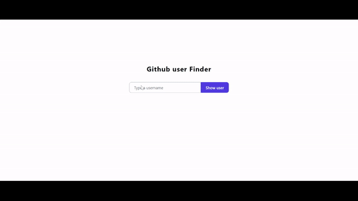

## Project Brief

A web application that displays github users' profile and their public repositories. When a user types a github username and clicks on the "Show user", the user is redirected to another page that displays the Profile and Public repositories of a github user. If the username is incorrect, an error message is displayed. Each repository is clickable and linked to the original github Project.

### Technologies used

- React js
- Tailwind css

### Demo

### `npm start`

Runs the app in the development mode.\
Open [http://localhost:3000](http://localhost:3000) to view it in your browser.
